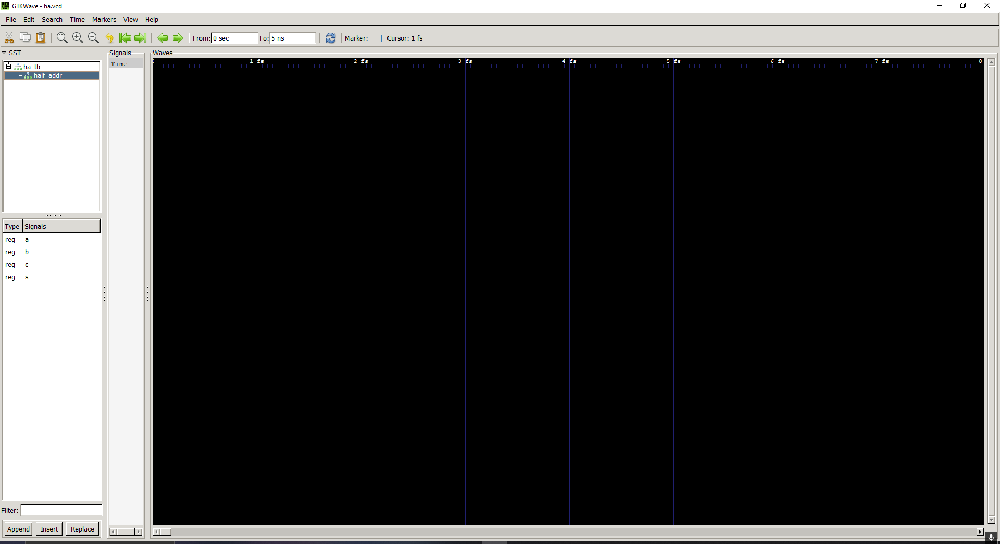
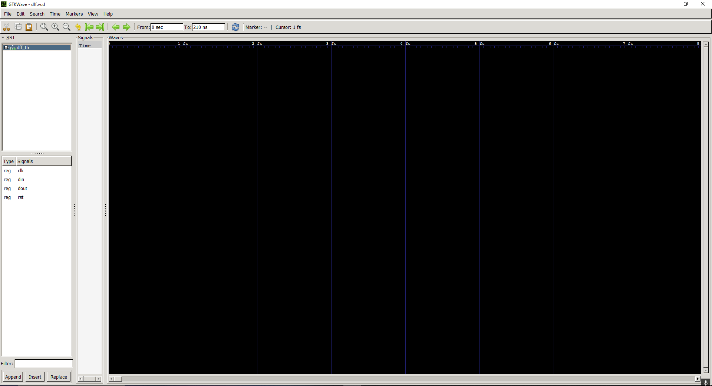

# Lab 1

Completing this lab was a bit more annoying than expected. Some of the instructions for download we're unclear in the GHDL and GTKWAVE.
I still think there is an error with the GTKWave preview of both of my examples but I followed the instruction to the tee. 
Half Adder Code
```
 ghdl -a ha.vhdl
 ghdl -a ha_tb.vhdl
 ghdl -e ha_tb
 ghdl -r ha_tb --vcd=ha.vcd
 gtkwave ha.vcd
```


DFF Code
```
 ghdl -a dff.vhdl
 ghdl -a dff_tb.vhdl
 ghdl -e dff_tb
 ghdl -r dff_tb --vcd=dff.vcd
 gtkwave dff.vcd
```


