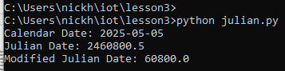
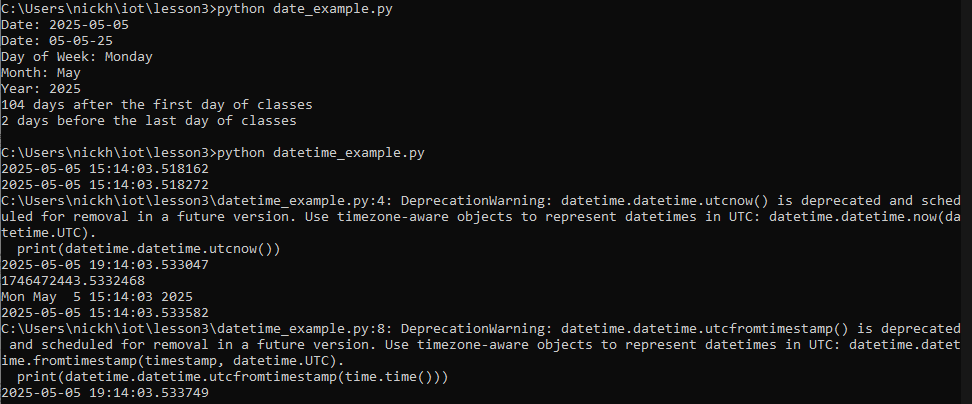
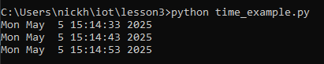
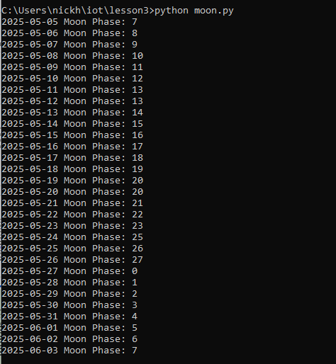
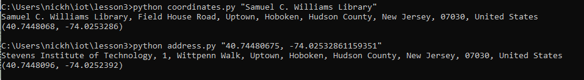
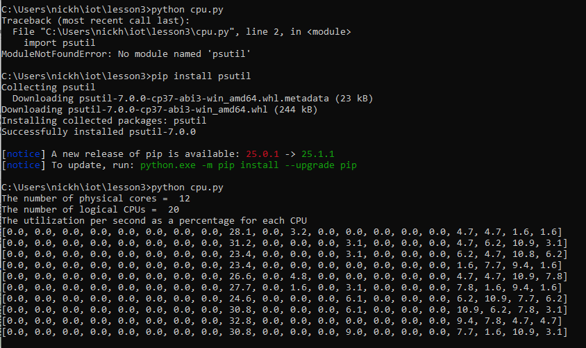
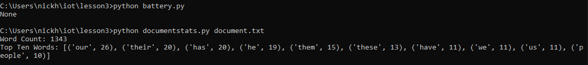

Lab 3
The commands listed on the slides are for linux so i had to re-appropriate them to windows equivalents. One example is python3 does not work for windows it's just python.

`python julian.py`



```
python date_example.py
python datetime_example.py
```



`python time_example.py`



`python sun.py "New York"`


`python moon.py`



```
python coordinates.py "Samuel C. Williams Library"
python address.py "40.74480675, -74.02532861159351"
```



`python cpu.py`



```
python battery.py
python documentstats.py document.txt
```




