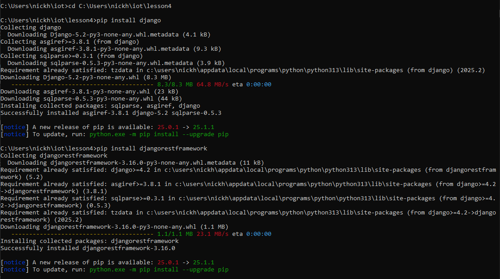
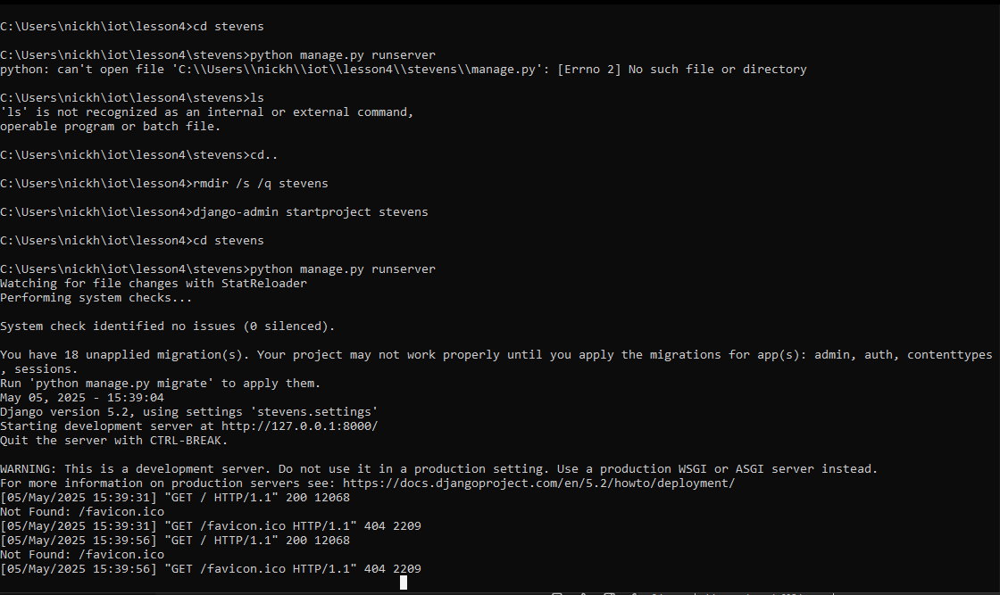
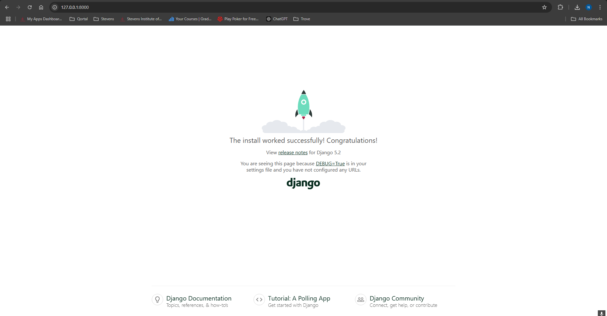
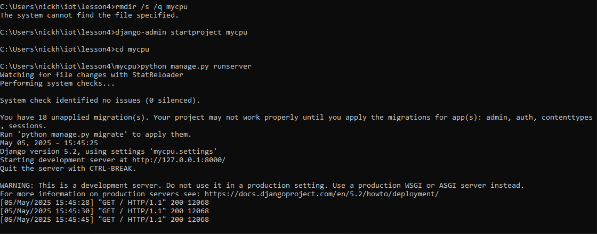
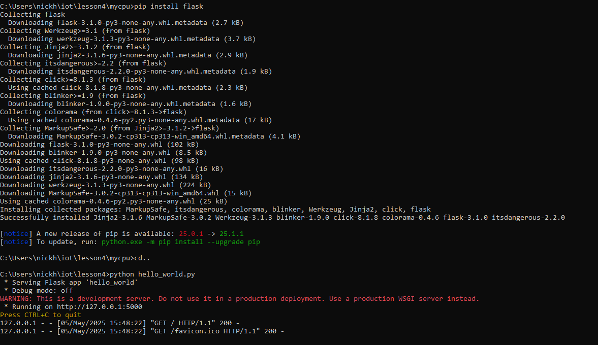
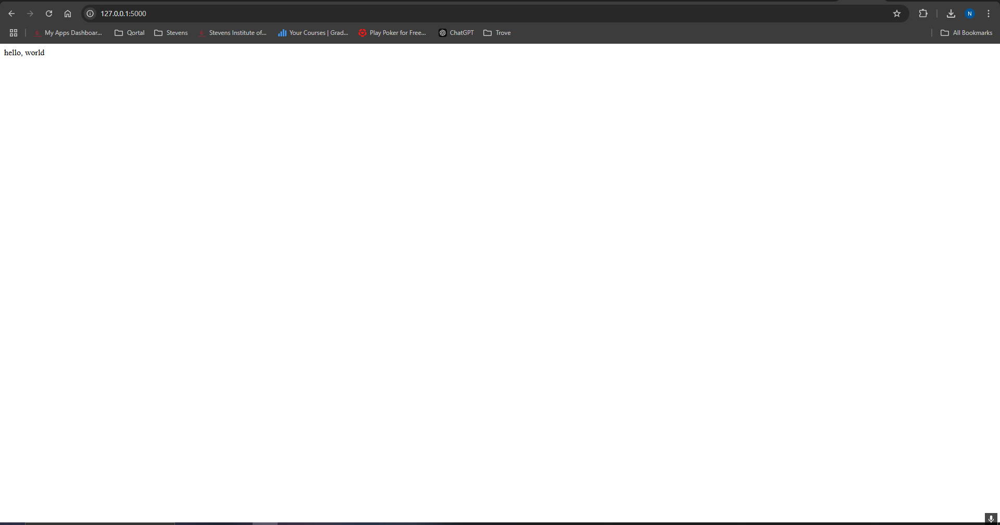

Lab 4
Git was already cloned.
Ran these commands first

```
cd C:\Users\nickh\iot\lesson4
pip install django
pip install djangorestframework
```


Then tried:
`django-admin startproject stevens`
But stevens folder already exists so:
`cd stevens`
Then try:
`python manage.py runserver`
But there is a problem because the manage.py doesnt exist.
Need to delete and create again the stevens folder so the manage.py does exist:
```
cd ..
rmdir /s /q stevens
django-admin startproject stevens
cd stevens
python manage.py runserver
```



For the CPU server it was the exact same process:
Tried running the manage.py but it doesnt exist in the folder so delete and recreate then run



Finally for the hello_world:
```
cd..
pip install flask
python hello_world.py
```




