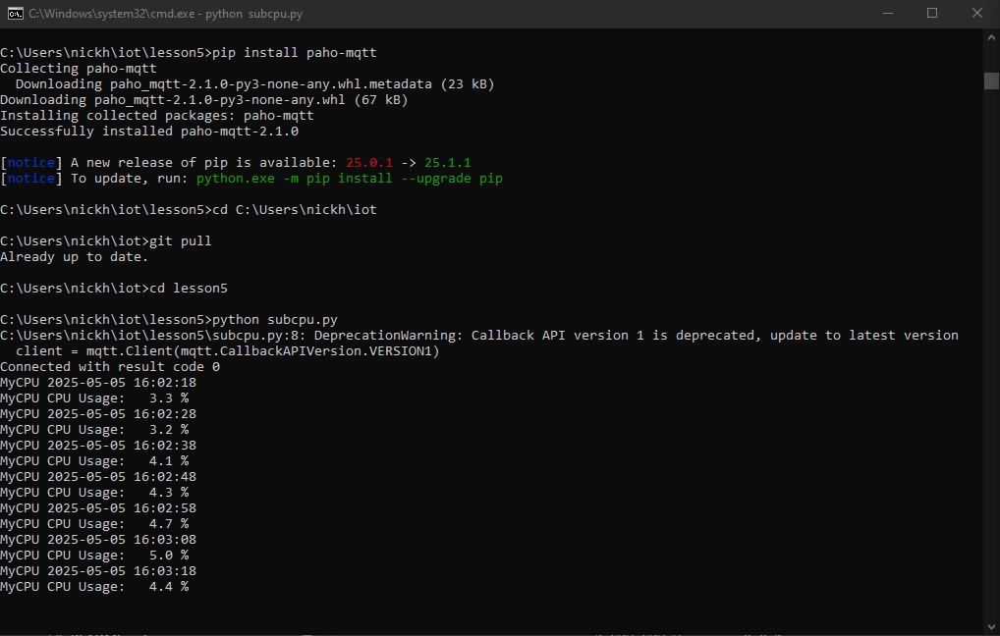
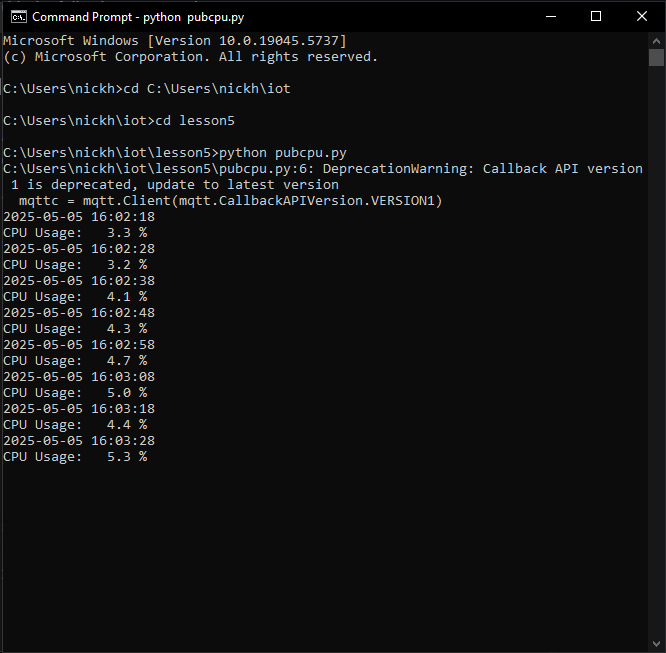

Lab 5
This lab was pretty straightforward
Once again repository was already cloned so in terminal 1:
```
cd C:\Users\nickh\iot\lesson5
pip install paho-mqtt
cd C:\Users\nickh\iot
git pull
cd lesson5
python subcpu.py
```


In terminal 2:
```
cd C:\Users\nickh\iot
cd lesson5
python pubcpu.py
```


