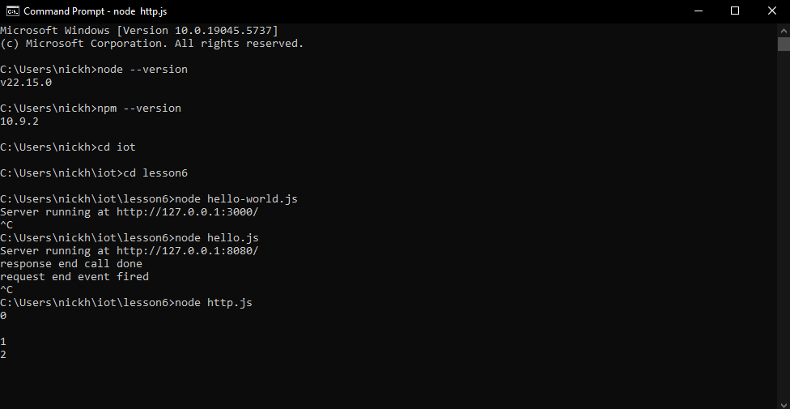
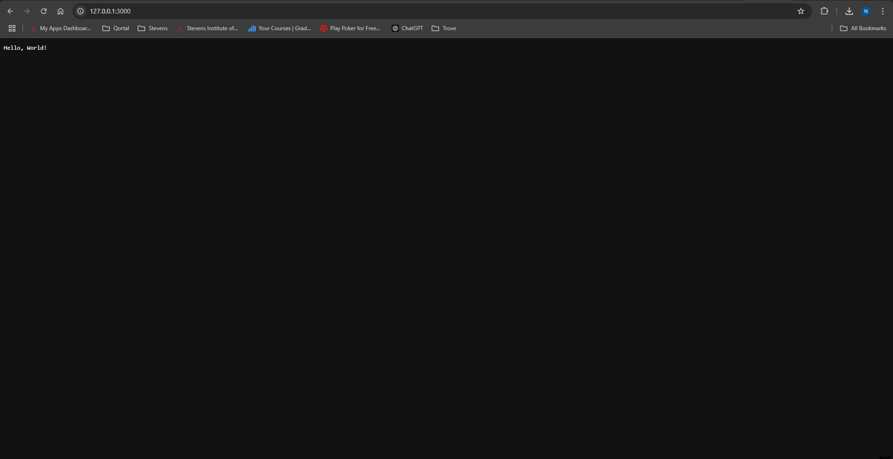
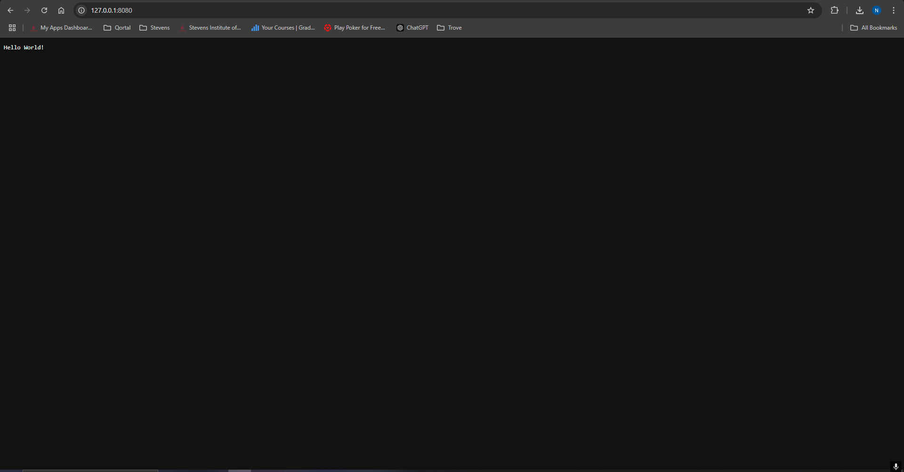
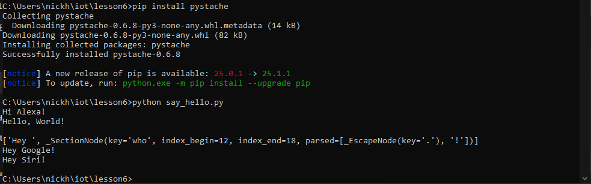

Lab 6
First install node.js through its website
Check versions to make sure it's installed properly:
```
node --version
npm --version
```
Go to Lesson 6 folder:
```
cd lesson6
node hello-world.js
node hello.js
node http.js
```





Now for pystache:
```
pip install pystache
python say_hello.py
```


