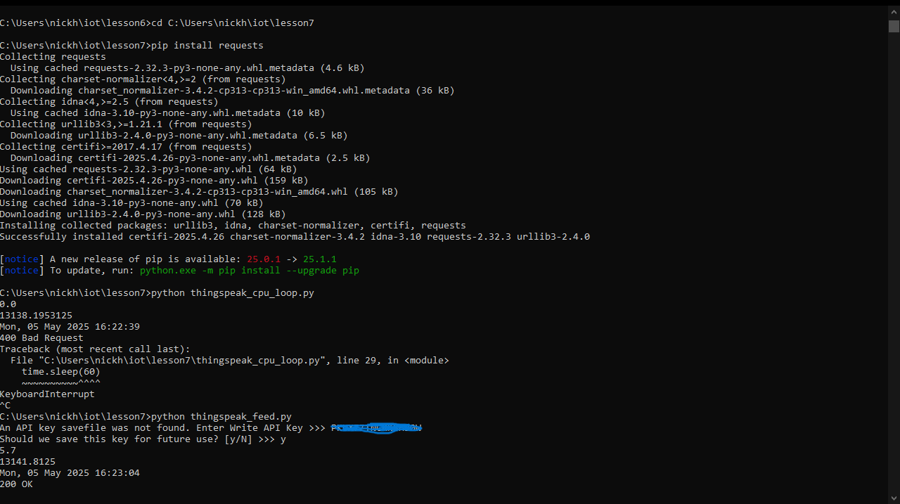
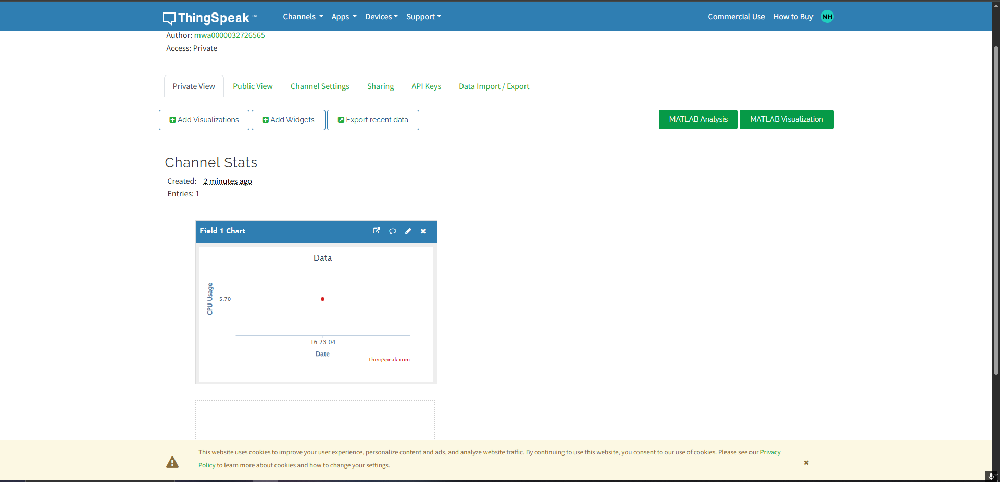
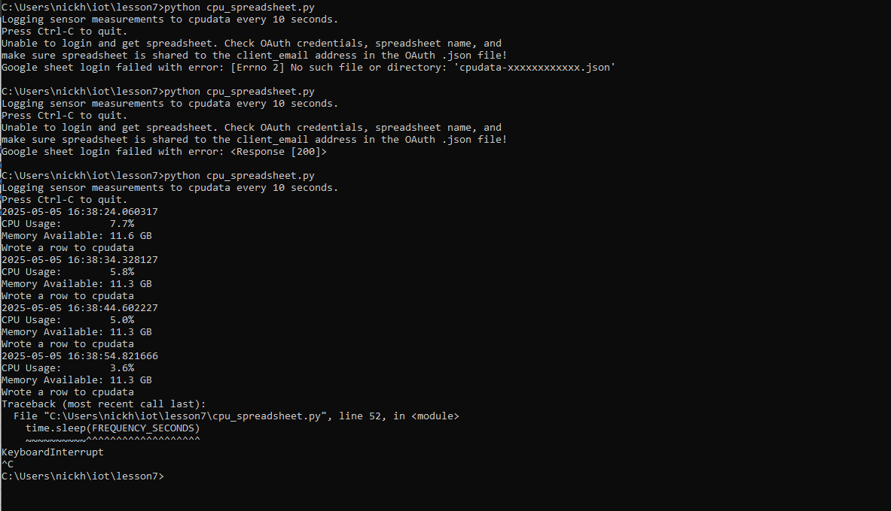
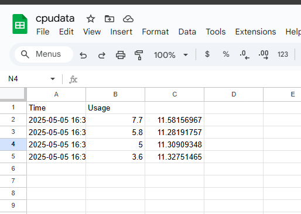

Lab 7
Had a bunch of trouble with this one but it was really satisfying to get it working in the end.
To begin:
`cd C:\Users\nickh\iot\lesson7`
Now go to https://thingspeak.mathworks.com and create an account
Click "New Channel"
Create a channel called Cpu data
Name field 1 cpu usage
Copy the Write API Key for the script

Now run:
```
pip install requests
python thingspeak_cpu_loop.py
```
Then add API when prompted

As you can see the usage is 5.7%
Now check the website to make sure it worked:

It did!

Moving on:
`pip install gspread oauth2client`
Go to: https://console.cloud.google.com
Create new project call it cpudata
Enable Google Drive API and Google Sheets API
Under IAM & Admin\Service Accounts:
Create a new service account
Create a JSON key file, will download to your PC
Create a new google sheet on a different google account than what you created the project on
Name it cpudata (exactly)
Share it with the account you created the project on
Now run:
`python cpu_spreadsheet.py`
I ran into some issues here:
```
python cpu_spreadsheet.py
Logging sensor measurements to cpudata every 10 seconds.
Press Ctrl-C to quit.
Unable to login and get spreadsheet. Check OAuth credentials, spreadsheet name, and
make sure spreadsheet is shared to the client_email address in the OAuth .json file!
Google sheet login failed with error: [Errno 2] No such file or directory: 'cpu-data-xxxxxxxxxxxx.json'
```
So after some troubleshooting and consulting with chatGPT I realized I had to go into the file and manually change the name of the cpu-data json file to mine.
Additionally, sharing the google sheet with the account that made the project didnt work, so I had to copy the raw string which linked to that google account and share it with that instead.
Running again:
`python cpu_spreadsheet.py`


It works!
